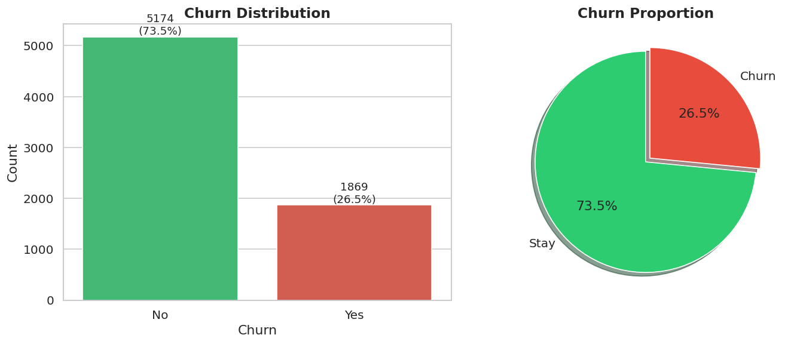
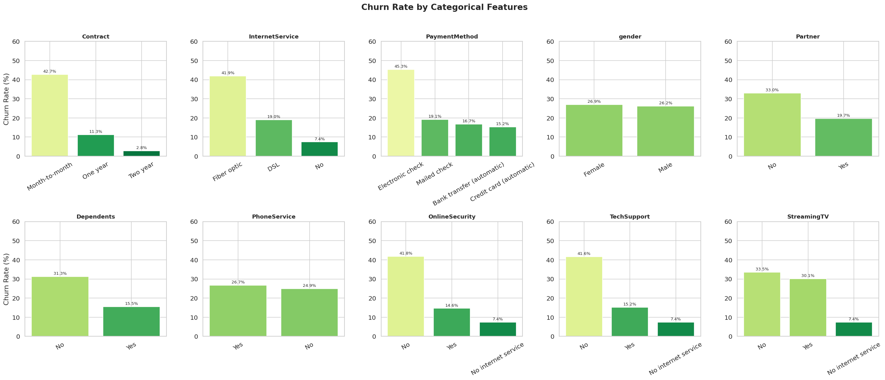
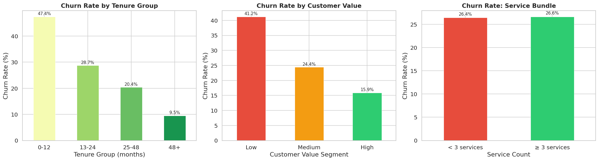
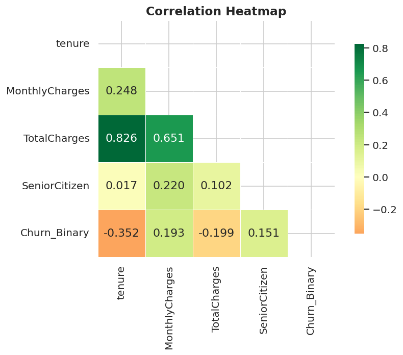
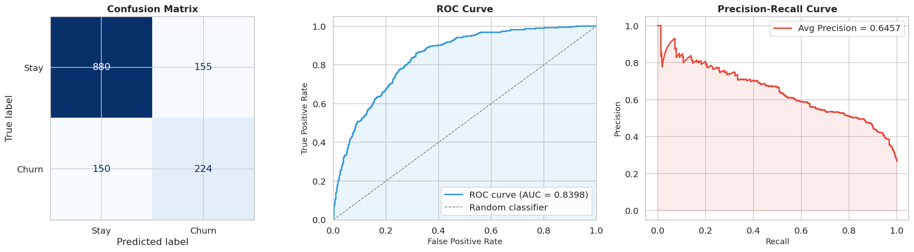
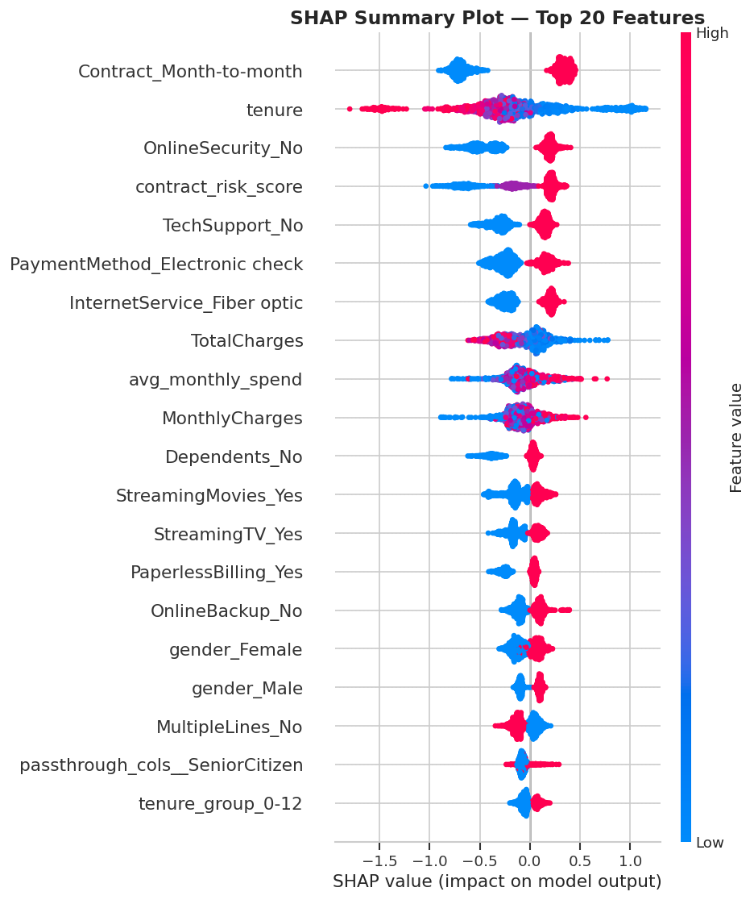

# Customer Churn Prediction App

> End-to-end churn prediction and explainable machine learning for telecom customer retention.

A full-stack machine learning project that predicts whether a telecom customer is likely to churn and explains the prediction with **SHAP**. Built with **React**, **Django REST Framework**, and **XGBoost**, the application combines interactive customer risk scoring, model interpretability, and business-oriented retention insights in a single end-to-end system.

---

## Project Overview

This project combines a **React frontend**, **Django REST API**, and an **XGBoost churn model** to predict whether a telecom customer is likely to leave and explain the prediction with SHAP.

| Layer | Technology | Purpose |
|-------|-----------|---------|
| Frontend | React + Vite | Customer input form, results display, dashboard |
| Backend | Django REST Framework | Validation, preprocessing, model inference |
| ML Model | XGBoost + SHAP | Binary churn prediction with explainability |
| Dataset | IBM Telco Customer Churn | 7,043 customer records |

## Business Problem

Telecom companies lose \$1,000–\$3,000 per churned customer in acquisition costs alone. This project helps teams:

- identify at-risk customers **before** they cancel
- understand **why** a customer is likely to churn
- connect model outputs to **actionable retention strategies**

## Key Results

- **Cross-validation ROC-AUC:** ~0.8405
- **Test ROC-AUC:** ~0.8398
- **Most important churn drivers:** month-to-month contracts, short tenure, no online security, no tech support, high monthly charges, fiber optic service, and electronic check payments
- **Business takeaway:** the notebook estimates that a **15% churn reduction could produce over \$1 million in impact** through retained revenue and avoided acquisition costs

## Key Visualizations

These visuals are generated from `notebooks/churn_model.ipynb` and saved in `data/`.

### 1. Churn Distribution

The dataset is clearly imbalanced, with far more customers staying than churning.



### 2. Churn Rate by Key Categorical Features

Contract type, internet service, payment method, and support-related features show strong churn differences.



### 3. Feature Engineering Insights

The engineered features confirm that newer customers and lower-value segments churn at notably higher rates.



### 4. Correlation Heatmap

Numeric relationships in the cleaned dataset show churn moving inversely with tenure and positively with monthly charges.



### 5. Model Evaluation

The confusion matrix, ROC curve, and precision-recall curve summarize how the classifier performs on unseen test data.



### 6. SHAP Summary Plot

The SHAP beeswarm plot highlights the features with the greatest impact on churn predictions across the dataset.



---

## ML Workflow Summary

The notebook `notebooks/churn_model.ipynb` covers the full workflow from raw dataset to deployment-ready artifacts.

1. **Load and explore the data** to inspect class balance, feature distributions, and churn patterns.
2. **Clean the dataset** by fixing `TotalCharges`, handling missing values, dropping `customerID`, and encoding `Churn`.
3. **Engineer domain features** including `tenure_group`, `avg_monthly_spend`, `has_multiple_services`, `contract_risk_score`, and `customer_value_segment`.
4. **Preprocess inputs** with a `ColumnTransformer` using scaling, one-hot encoding, and passthrough numeric features.
5. **Balance the training data with SMOTE** before fitting the XGBoost classifier.
6. **Evaluate the model** with confusion matrix, ROC, precision-recall, and standard classification metrics.
7. **Explain predictions with SHAP** using global and local interpretation plots.
8. **Save and verify artifacts** in `backend/ml/` for backend inference.

### Notebook Deliverables

The final notebook cells save and verify:

- `backend/ml/model.pkl`
- `backend/ml/preprocessor.pkl`
- evaluation plots in `data/`
- SHAP visualizations in `data/`

---

## Project Structure

```text
Customer-Churn-Prediction/
├── backend/
│   ├── api/
│   ├── ml/
│   │   ├── model.pkl
│   │   └── preprocessor.pkl
│   ├── manage.py
│   └── requirements.txt
├── frontend/
│   ├── src/
│   ├── package.json
│   └── vite.config.ts
├── notebooks/
│   └── churn_model.ipynb
├── data/
│   ├── telco_churn.csv
│   └── *.png
├── README.md
├── render.yaml
└── .gitignore
```

---

## Setup & Running

### 1. Download the Dataset

Download the **IBM Telco Customer Churn** dataset from Kaggle:

```
https://www.kaggle.com/datasets/blastchar/telco-customer-churn
```

Save it as: `data/telco_churn.csv`

**Expected filename:** `data/telco_churn.csv`

**Dataset size:** ~7,043 rows × 21 columns

#### Dataset Columns

| Column | Type | Description |
|--------|------|-------------|
| customerID | string | Unique customer identifier (dropped during cleaning) |
| gender | string | Male / Female |
| SeniorCitizen | int | 0 = No, 1 = Yes |
| Partner | string | Yes / No |
| Dependents | string | Yes / No |
| tenure | int | Months with company |
| PhoneService | string | Yes / No |
| MultipleLines | string | Yes / No / No phone service |
| InternetService | string | DSL / Fiber optic / No |
| OnlineSecurity | string | Yes / No / No internet service |
| OnlineBackup | string | Yes / No / No internet service |
| DeviceProtection | string | Yes / No / No internet service |
| TechSupport | string | Yes / No / No internet service |
| StreamingTV | string | Yes / No / No internet service |
| StreamingMovies | string | Yes / No / No internet service |
| Contract | string | Month-to-month / One year / Two year |
| PaperlessBilling | string | Yes / No |
| PaymentMethod | string | Electronic check / Mailed check / Bank transfer / Credit card |
| MonthlyCharges | float | Monthly bill amount |
| TotalCharges | string | Total amount charged (may need type conversion) |
| Churn | string | Target: Yes / No |

### 2. Train the Model (Google Colab / Jupyter)

Open `notebooks/churn_model.ipynb` and run all cells. The notebook saves:
- `backend/ml/model.pkl`
- `backend/ml/preprocessor.pkl`

### 3. Run the Backend

```bash
cd backend
pip install -r requirements.txt
python manage.py migrate
python manage.py runserver 8000
```

### 4. Run the Frontend

Set the backend API URL, then run the Vite app:

```bash
cd frontend
npm install
npm run dev
```

For local development, create a `.env` file in `frontend/` with:

```bash
VITE_API_BASE_URL=http://127.0.0.1:8000
```

---

## API Reference

### `POST /api/predict/`

Predict churn for a single customer.

**Request Body:**
```json
{
  "tenure": 2,
  "monthlyCharges": 95.0,
  "totalCharges": 190.0,
  "gender": "Male",
  "seniorCitizen": 0,
  "partner": "No",
  "dependents": "No",
  "phoneService": "Yes",
  "multipleLines": "No",
  "internetService": "Fiber optic",
  "onlineSecurity": "No",
  "onlineBackup": "No",
  "deviceProtection": "No",
  "techSupport": "No",
  "streamingTV": "No",
  "streamingMovies": "No",
  "contract": "Month-to-month",
  "paperlessBilling": "Yes",
  "paymentMethod": "Electronic check"
}
```

**Response:**
```json
{
  "prediction": "Churn",
  "probability": 0.89,
  "riskLevel": "High",
  "factors": [
    "Month-to-month contract",
    "New customer (0-6 months tenure)",
    "High monthly charges (>$80)",
    "Fiber optic internet service",
    "Electronic check payment"
  ]
}
```

### `GET /api/dashboard/stats/`

Returns aggregate statistics from the IBM Telco dataset.

### `GET /api/predictions/history/`

Returns the 20 most recent predictions made in this session.

---

## Model Performance

The notebook evaluation reports the following test-set results:

| Metric | Score |
|--------|-------|
| Accuracy | ~78.35% |
| Precision | ~0.59 |
| Recall | ~0.60 |
| F1 Score | ~0.59 |
| ROC-AUC | ~0.8398 |

> Recall is especially important in churn prediction because false negatives can hide customers who are likely to leave.

---

## Business Insights

| SHAP Finding | Business Recommendation |
|---|---|
| Month-to-month contracts → high churn | Offer 15% discount for annual contract upgrade |
| Short tenure → high churn | Improve onboarding: proactive check-ins at 30/60/90 days |
| High monthly charges → high churn | Introduce loyalty discount tiers for high-spend customers |
| Fiber optic without security add-ons → churn | Bundle security services with fiber plans |
| Electronic check payment → churn | Incentivize auto-pay enrollment with a billing credit |

---

## Deployment on Render

1. Push this repository to GitHub
2. Connect the GitHub repo to [Render](https://render.com)
3. Use the included `render.yaml`, which creates:
   - **Web Service**: Django API from `backend/`
   - **Static Site**: React app from `frontend/`

Before deploying, run the notebook and commit these generated files:
- `backend/ml/model.pkl`
- `backend/ml/preprocessor.pkl`

---

## Tech Stack

- **React** + Vite + TailwindCSS
- **Django** 4.2 + Django REST Framework
- **XGBoost** 2.0
- **scikit-learn** + imbalanced-learn (SMOTE)
- **SHAP** (explainability)
- **pandas** + numpy
